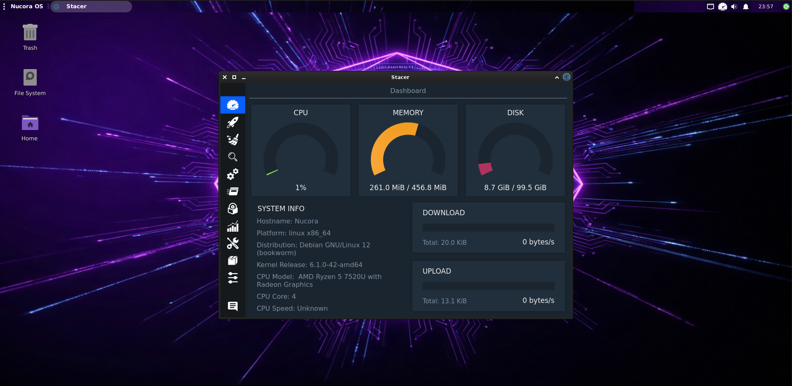
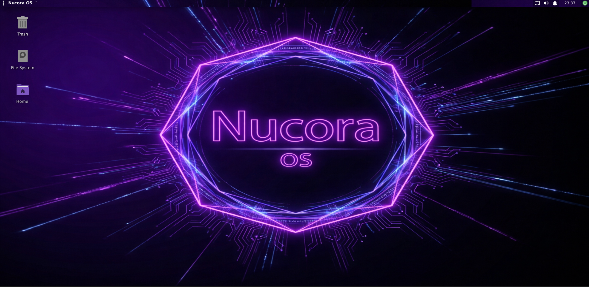

# !! KURMADAN ÖNCE OKUYUN !!
🚀 Nucora OS (Alpha)

⬇️İndirme Bağlantısı⬇️

https://drive.google.com/file/d/10HzxB4zV_eiXAO7MCTRcakolLTDv1eIj/view 

⬆️ISO Boyutu: 1.7 GB⬆️
-
-
-
Dikkat: Bu bir Alpha sürümüdür. Hatalar ve eksiklikler olabilir. Lütfen kurulum öncesi bunu göz önünde bulundurun! ⚠️

Nucora OS, hafif ve minimal Linux tabanlı bir işletim sistemidir. Eski bilgisayarlarda bile çalışacak şekilde tasarlanmıştır. 💻✨

💾 Minimum Sistem Gereksinimleri

RAM: 512 MB

Depolama: 10 GB

CPU: 1 çekirdek, 1 GHz

✨ Özellikler

Hafif ve hızlı XFCE masaüstü ortamı

Kurulum sonrası login manager olmadan tty 1 ile login

Minimal paketler ile düşük donanım dostu tasarım

⚙️ Kurulum Notları / Known Issues

ISO başlatıldığında kullanıcı adı ve şifre “nucora” olarak ayarlanmıştır. 🔑

Menüden setup açılmıyor, bu yüzden terminalden:

sudo eggs calamares

calamares

komutları ile setup ekranını açabilirsiniz.

Setup ekranında girilen kullanıcı adı ve şifre kurulum sırasında değiştirilemiyor, sadece makine adı değiştirilebilir.

Kurulum tamamlandıktan sonra bilgisayarı açtığınızda ana kullanıcı adı ve şifre yine “nucora” olacak. 🔒
